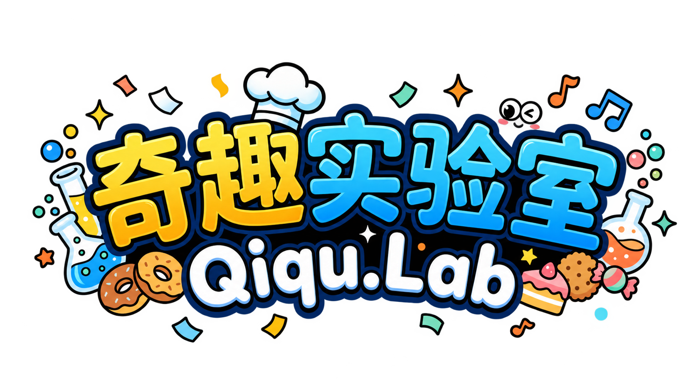
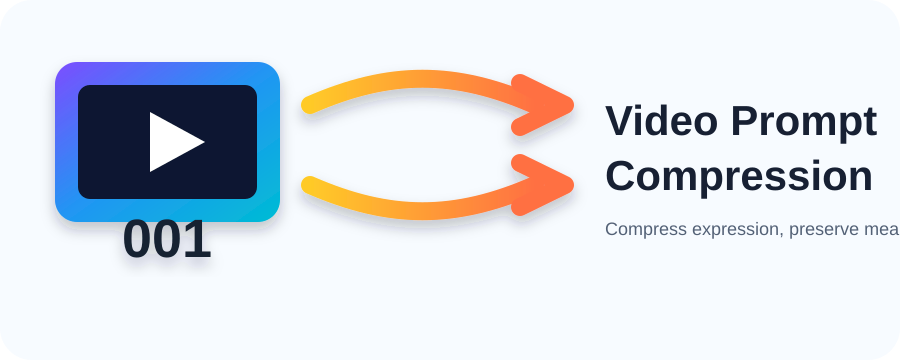
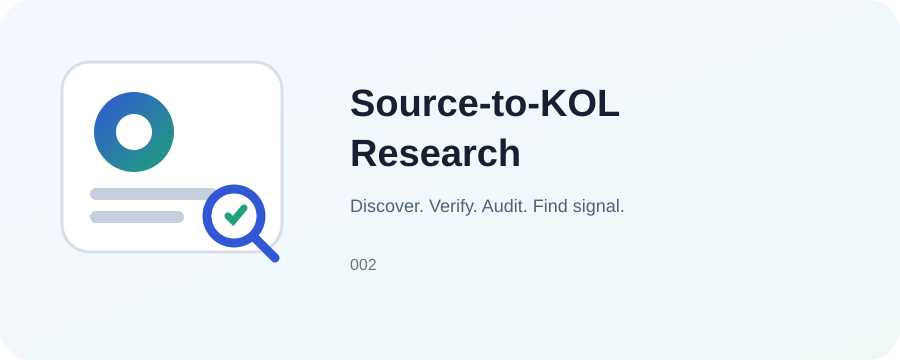
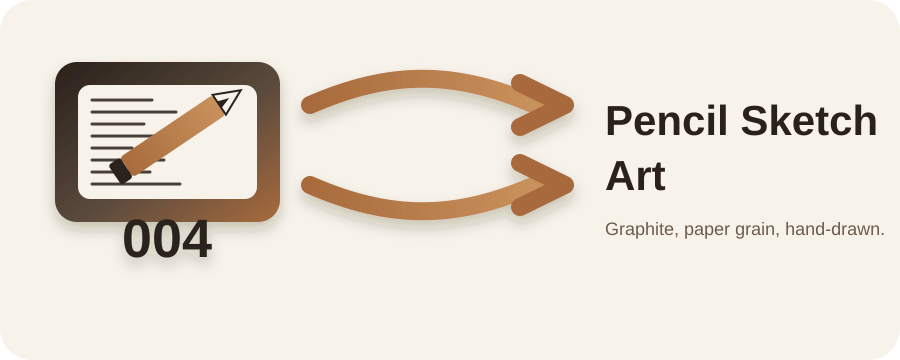
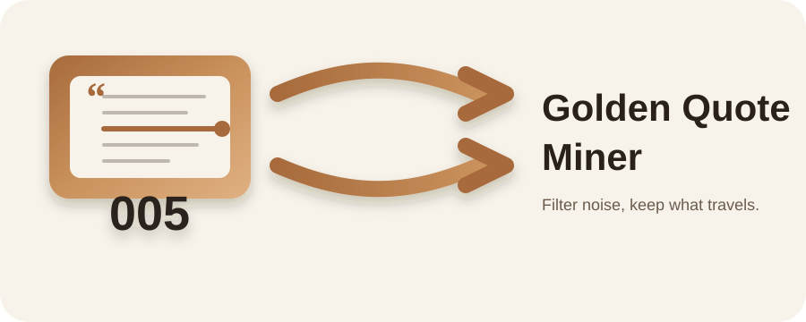
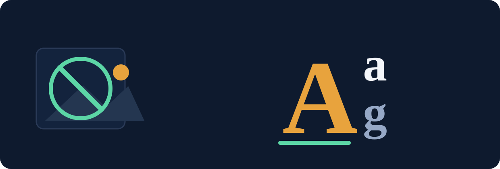
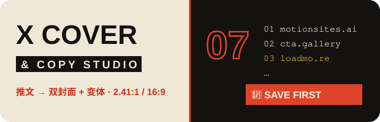
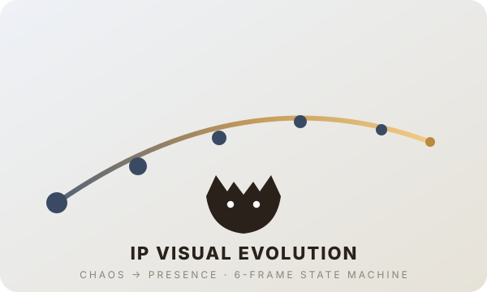
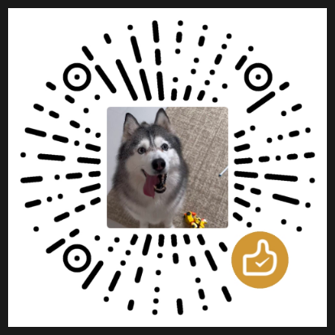

# Skills4QiquLab

**A practical AI Skill repository for turning effective AI working methods into reusable Skills and supporting resources.**

  
  
  
  
  
  

**English** · [简体中文](README.zh-CN.md) · [繁體中文](README.zh-TW.md)

## Visual Showcase

**[Open the Qiqu.Lab Showcase](docs/index.html)** — browse Cases and Skills as an interactive presentation layer. The repository remains the source of truth; the visual gallery is the discovery/remix layer.

## Community

No standalone public group is currently listed. Use [Issues](https://github.com/0xf4vul/Skills4QiquLab/issues) for discussion, feedback, and requests; use [Pull Requests](https://github.com/0xf4vul/Skills4QiquLab/pulls) for contributions.

## New Skills

- **NEW** [IP Visual Evolution Engine · 个人 IP 视觉进化引擎](skills/ip-visual-evolution-engine.md) ([Case 008](cases/008_ip-visual-evolution-engine/)) — turn a person's identity into a continuously-evolving visual IP, then compress it into a six-frame Xiaohongshu narrative + a portable X.com Banner; four fully self-contained platform adapters (Seedream / GPT / Grok / Gemini).
- **NEW** [X Cover & Copy Studio](skills/x-cover-copy-studio.md) ([Case 007](cases/007_x-cover-copy-studio/)) — one listy tweet in, two launch-ready ratio-locked posters + a variant copy line out, with hard row caps and a forced QA loop.
- **NEW** [Textless Backdrop](skills/imagegen-textless-composite.md) ([Case 006](cases/006_imagegen-textless-composite/)) — generate a wordless backdrop with an image model, then overlay Chinese headlines and key numbers with Pillow for pixel-perfect accuracy.
- **NEW** [Pencil Sketch Art](skills/pencil-sketch-art.md) ([Case 004](cases/004_pencil-sketch-art/)) — turn any subject or abstract concept into a graphite pencil sketch, with scripts for prompt assembly and ink-density cropping.
- **NEW** [Golden Quote Miner](skills/golden-quote-miner.md) ([Case 005](cases/005_golden-quote-miner/)) — turn long content into 5-12 sentences that survive on their own, via a four-stage funnel and eight sentence skeletons.
- [Video Prompt Compression](skills/video-prompt-compression.md) — compress video prompts while preserving action order, temporal relationships, camera behavior, and continuity.
- [Video Prompt Optimization](skills/video-prompt-optimization.md) — improve video prompt execution across action, timing, camera, and subject continuity.
- [X Research](skills/x-research.md) — make X-account and information-source research reproducible and evidence-based.

## Featured Projects

<table>
<tr>
<td width="50%" valign="top" align="center">

 <strong>Video Prompt Compression</strong> 
Compress video prompts without collapsing meaningful action chains, temporal relationships, camera logic, or subject continuity.
 <a href="cases/001_video-prompt-compression/">Case</a> · <a href="skills/video-prompt-compression.md">Skill</a>
</td>
<td width="50%" valign="top" align="center">

 <strong>Source-to-KOL Research</strong> 
Turn arbitrary inputs into a verifiable, auditable research workflow for KOLs and information sources.
 <a href="cases/002_source-to-kol-research/">Case</a> · <a href="skills/x-research.md">Skill</a>
</td>
</tr>
<tr>
<td width="50%" valign="top" align="center">

 <strong>Pencil Sketch Art</strong> 
Turn any subject or abstract concept into a graphite pencil sketch, with scripts for prompt assembly and ink-density cropping.
 <a href="cases/004_pencil-sketch-art/">Case</a> · <a href="skills/pencil-sketch-art.md">Skill</a>
</td>
<td width="50%" valign="top" align="center">

 <strong>Golden Quote Miner</strong> 
Turn long content into 5-12 sentences that survive on their own, via a four-stage funnel and eight sentence skeletons.
 <a href="cases/005_golden-quote-miner/">Case</a> · <a href="skills/golden-quote-miner.md">Skill</a>
</td>
</tr>
<tr>
<td width="50%" valign="top" align="center">

 <strong>Textless Backdrop</strong> 
Generate a wordless backdrop with an image model, then overlay Chinese headlines and key numbers with Pillow for pixel-perfect accuracy.
 <a href="cases/006_imagegen-textless-composite/">Case</a> · <a href="skills/imagegen-textless-composite.md">Skill</a>
</td>
<td width="50%" valign="top" align="center">
<a href="docs/index.html"><strong>View the interactive Showcase →</strong></a> <a href="https://0xf4vul.github.io/Skills4QiquLab/"><strong>Live Showcase (GitHub Pages) ↗</strong></a> <a href="https://0xf4vul.github.io/#log"><strong>Live iteration log on the site ↗</strong></a>
</td>
</tr>
<tr>
<td width="50%" valign="top" align="center">

 <strong>X Cover & Copy Studio</strong> 
Turn one listy tweet into two launch-ready X.com posters + a variant copy line. Hard row contracts, forced QA loop.
 <a href="cases/007_x-cover-copy-studio/">Case</a> · <a href="skills/x-cover-copy-studio.md">Skill</a>
</td>
<td width="50%" valign="top" align="center">

 <strong>IP Visual Evolution Engine</strong> 
Turn a person's identity into a continuously-evolving visual IP, then compress it into a six-frame Xiaohongshu narrative + a portable X.com Banner. Four self-contained platform adapters.
 <a href="cases/008_ip-visual-evolution-engine/">Case</a> · <a href="skills/ip-visual-evolution-engine.md">Skill</a>
</td>
</tr>
</table>

## Skill Entry

| | Skill | What it does |
|---|---|---|
| 🧩 | [Prompt Compression](skills/prompt-compression.md) | Reduce prompt redundancy while preserving intent and hard constraints |
| ✨ | [Prompt Optimization](skills/prompt-optimization.md) | Improve clarity, structure, and execution reliability |
| 🔬 | [Prompt Reverse Engineering](skills/prompt-reverse-engineering.md) | Extract reusable decision structures from strong prompts |
| 🎬 | [Video Prompt Compression](skills/video-prompt-compression.md) | Compress video prompts while preserving temporal semantics |
| 🎥 | [Video Prompt Optimization](skills/video-prompt-optimization.md) | Improve action, timing, camera, and subject continuity |
| 🌐 | [Web Research](skills/web-research.md) | Turn open questions into traceable, cross-checked evidence |
| 𝕏 | [X Research](skills/x-research.md) | Research X accounts, people, posts, and recent activity |
| 🛠️ | [Skill Builder](skills/skill-builder.md) | Turn repeated work into reusable, testable Skills |
| ✏️ | [Pencil Sketch Art](skills/pencil-sketch-art.md) | Turn a subject or abstract concept into a graphite pencil sketch |
| 💬 | [Golden Quote Miner](skills/golden-quote-miner.md) | Distill long content into lines that survive on their own |
| 🖼️ | [Textless Backdrop](skills/imagegen-textless-composite.md) | Generate a wordless backdrop, then overlay Chinese headlines and numbers with Pillow |
| 📰 | [X Cover & Copy Studio](skills/x-cover-copy-studio.md) | Turn a listy tweet into two X-launch posters plus a near-style variant |
| 🐾 | [IP Visual Evolution Engine](skills/ip-visual-evolution-engine.md) | Turn identity into a continuous visual IP, then a six-frame Xiaohongshu narrative + X Banner |

→ [Full Skill Index](skills.md)

## How to Use the Library

The repository has two layers: **Core Skills** provide reusable methods; **Skill Cases** package those methods into complete, executable examples.

**Choose a Skill → open its Skill file → follow its Workflow → use templates/examples → run Evaluation → adapt and reuse.**

Every Skill should expose the same practical contract:

| Skill | Purpose | Workflow | Evaluation |
|---|---|---|---|
| Prompt Compression | Preserve intent while removing redundancy | Extract goal → constraints → redundancy → merge → validate | Intent / constraints / relationships / clarity / reduction |
| Prompt Optimization | Improve execution without changing intent | Intent → constraints → ambiguity → restructure → validate | Fidelity / coverage / ambiguity / robustness |
| Prompt Reverse Engineering | Convert strong prompts into reusable structures | Observe → variables → structure → template → test | Transferability / control / clarity |
| Video Prompt Compression | Shorten video prompts without losing motion semantics | Parse → semantic units → classify → merge → validate | Semantics / temporal coherence / action continuity |
| Video Prompt Optimization | Make video actions and camera instructions executable | Intent → subject → action → time → camera → constraints | Action / timing / camera / consistency |
| Web Research | Produce traceable answers from open questions | Scope → search → filter → cross-check → synthesize → cite | Relevance / source quality / freshness / citation |
| X Research | Verify and analyze X activity with explicit criteria | Discover → verify → inspect → filter → compare | Identity / recency / evidence / consistency |
| Skill Builder | Turn repeated work into maintainable Skills | Trigger → boundaries → workflow → contract → tests → iterate | Consistency / transferability / inspectability |
| Pencil Sketch Art | Turn a subject or abstract concept into a sketch that reads as hand-drawn | Name subject → pick aspect → pick stroke preset → assemble prompt → generate → crop by ink density → self-check | Hand-drawn feel / paper tone / subject clarity / safe title area |
| Golden Quote Miner | Distill lines that survive detached from the source | Candidate scan → density filter → tension scoring → detachment test → manual sweep | Density / tension / rhythm / detachment / skeleton coverage |
| Textless Backdrop | Generate a wordless base, then overlay type with Pillow | Lock palette → generate wordless base → strip watermark → overlay type → verify | Wordless base / number accuracy / font integrity / palette anchoring / no overflow |
| X Cover & Copy Studio | Listy tweet → poster pair + variant copy, zero silent clipping | Fit-gate → deconstruct refs → payload → render(2x) → crop QA loop → deliver | Row completeness / footer / occlusion / tofu / font weight / fact fidelity / ad-law |
| IP Visual Evolution Engine | Turn identity into a continuously-evolving visual IP | Fill DNA → pick adapter → frame-by-frame generate → Banner adapt → evaluate | Identity continuity / narrative continuity / entropy gradient / platform adaptation / banner readiness |

For a complete applied workflow, go to [cases/](cases/). For creating a new Skill, start with [Skill Builder](skills/skill-builder.md) and [templates/skill-template.md](templates/skill-template.md).

## Disclaimer

This repository is for learning, experimentation, and reusable AI workflow practice. Examples and third-party references remain subject to their original sources, licenses, and platform rules. Verify applicable rights before commercial use.

## Star History

---

## Support the Project

If Skills4QiquLab saves you time, ships something for you, or quietly becomes part of your daily workflow, consider supporting independent, open work:

  
  

Buy Me a Coffee settles through Stripe, so it needs a foreign-currency card. If that is a blocker, tip through WeChat instead — any amount, no card needed:

  

Free ways to help, roughly in order of impact:

- ⭐ **Star the repository** — the cheapest signal that this library is worth keeping alive.
- 🔗 **Cite and share it** — link back when you reuse a Skill or remix a Case; attribution is what turns a repo into a reference.
- 🐛 **Open an issue** — a real failure case is worth more than praise. Every Skill has a *Failure modes* section for exactly this.
- 🤝 **Send a pull request** — new Skills, new Cases, sharper evaluation rubrics, even typo fixes. All of it counts.
- 🍴 **Fork and remix** — adapt a method to your own domain, then publish what changed.

Every Skill here exists because someone turned a repeated piece of work into a reusable method. Contributions and sponsorship both go to the same place: more of that.

---

## License

[MIT License](LICENSE)
