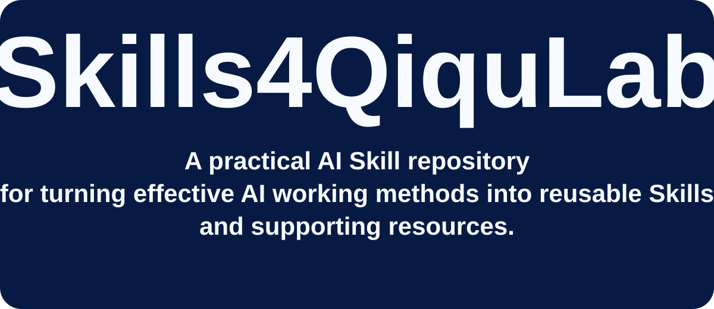

<strong>一個面向實踐的 AI Skill 儲存庫</strong> 將有效的 AI 工作方法整理為可複用的 Skills 與配套資源。

> 🌐 **其他語言：** 🇨🇳 [简体中文](README.zh-CN.md) &nbsp;|&nbsp; 🇹🇼 [繁體中文](README.zh-TW.md)

# Qiqu.Lab — 一個面向實踐的 AI Skill 儲存庫

Qiqu.Lab 是一個面向實踐的 AI Skill 儲存庫，用於將有效的 AI 工作方法整理為**可複用的 Skill 與配套資源**。

<table>
<tr>
<td align="center" width="20%"><h2>⚡</h2><b>Core Skills</b> Reusable methods</td>
<td align="center" width="20%"><h2>▣</h2><b>Skill Cases</b> Applied workflows</td>
<td align="center" width="20%"><h2>▤</h2><b>Templates</b> Reusable structures</td>
<td align="center" width="20%"><h2>💡</h2><b>Examples</b> Practical references</td>
<td align="center" width="20%"><h2>▥</h2><b>Evaluation</b> Quality checks</td>
</tr>
</table>

## 🚀 快速開始

**探索** → [Core Skills](skills/) · [Skill 索引](skills.md) · [Cases](cases/)  
**建立** → [Skill Builder](skills/skill-builder.md) · [Global Template](templates/skill-template.md)

### 精選 Cases

| Case | 重點 | 入口 |
|---|---|---|
| **001 · Video Prompt Compression** | 壓縮影片提示詞，同時保護動作、時間、鏡頭與連續性語義。 | [開啟 Case](cases/001_video-prompt-compression/) |
| **002 · X Account Verification** | 核驗 X 帳號身份、統計近 30 天活躍度，並篩選實用資訊源。 | [開啟 Case](cases/002_x-account-verification/) |

## 📁 儲存庫結構

~~~text
Skills4QiquLab/
├── README.md
├── README.zh-CN.md
├── README.zh-TW.md
├── skills.md
├── skills/
├── templates/
├── assets/
└── cases/
    ├── 001_video-prompt-compression/
    └── 002_x-account-verification/
~~~

> **Case 編號與 Logo 規則：** cases/ 下統一使用 NNN_skill-name/。每個 Case 提供與自身核心主題對應的專屬 Logo；Qiqu.Lab Logo 僅用於儲存庫品牌識別。

## 📚 索引

[Skills 索引](skills.md) · [Core Skills](skills/) · [Skill Cases](cases/) · [Global Templates](templates/)

## 📄 許可

MIT 許可 · [LICENSE](LICENSE)

建立 → test → iterate → reuse.

