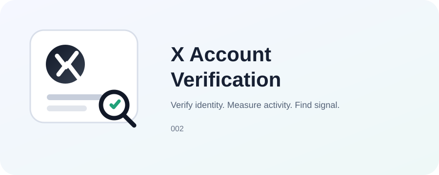

# 002 — Source-to-KOL Discovery & Account Verification

> Case ID: 002_x-account-verification

将人物名单、URL、文章、社交媒体内容、视频、Podcast、PDF、图片、文件或用户粘贴的内容，转化为可验证、可审计的 KOL / 信息源清单。

## Case 结构

**SKILL.md → templates → examples → evaluation → assets**

## 使用

直接阅读 SKILL.md；需要重复执行时进入 templates/；需要参考输入输出时进入 examples/；需要质量检查时进入 evaluation/。

## 输入范围

本 Case **不绑定单一平台**。输入可以来自 X、LinkedIn、YouTube、Reddit、Instagram、Threads、GitHub、网页、文章、Podcast、PDF、图片、文件或用户直接提供的内容。

## 核心原则

**先确认内容中的角色，再确认人物身份，再确认账号归属，最后统计活跃度与内容信号。**

不要把所有被提及的人自动视为 KOL，也不要为了填满表格而强行匹配账号。
